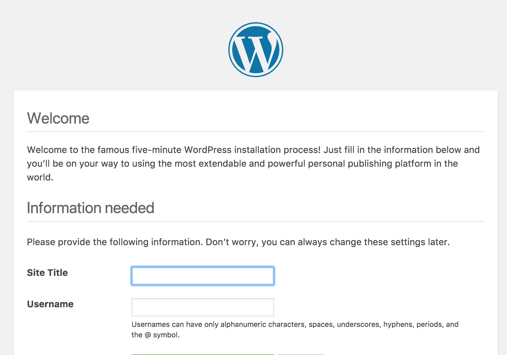

# :books: Lab Session 1: Virtual Machines
LINGI2145 Autumn, 2018 -- Etienne Rivière and Raziel Carvajal-Gómez

# Objectives
In this tutorial, you will learn how to deploy a virtual infrastructure with several virtual machines linked by a virtual network, on your own laptop. You will then deploy a representative application (web hosting service) on this virtual infrastructure. At the end of this tutorial you will have learnt how to:

- deploy a couple of Virtual Machines (VMs);
- create a network to let Virtual Machines (VM) communicate with each other;
- let your host machine be part of a virtual network;
- install and deploy a web hosting service.

:warning: We do encourage you to follow the tutorial solo.

:warning: As for all other tutorials and for the project in LINGI2145, this tutorial assumes you are using an operating system with a UNIX-like command line built-in, such as MacOS X or any flavor of GNU/Linux.

:warning: This tutorial demands you to complete some exercises that are tagged with the symbol: :pencil2:.

# Prerequisites
We will use [VirtualBox](https://www.virtualbox.org/) to deploy the infrastructure. The installation files are available at:

- [GNU/Linux based host](https://www.virtualbox.org/wiki/Linux_Downloads) such as: Debian, Ubuntu, Fedora, others
- [OS X](https://download.virtualbox.org/virtualbox/5.2.18/VirtualBox-5.2.18-124319-OSX.dmg)

Install VirtualBox by following the instructions. Consult the [official documentation](https://www.virtualbox.org/manual/ch02.html) for more details or troubleshooting.

# Setting up one Virtual Machine
Our goal is to deploy multiple VMs on the same host (your laptop). We will only access these VMs through the network. There is no need for a full desktop operating system with a GUI and many pre-installed software packages. We also want to limit the amount of resources (hard drive space, CPU, memory). VMs will host a minimalistic GNU/Linux OS with only the necessary software packages.

:warning: Considering that your local machine will host every VM we will create in this tutorial, the creation of minimal VMs avoids decreasing the performance of your system.

#### Setting up hard drive, CPU and memory
VBoxManage is the command line interface of VirtualBox. While using the GUI might seem simpler at first, it is not possible to do so in scripts. Learning the CLI right from the start is therefore better. The CLI allows controlling all features of the virtualization engine. We will use some useful commands of this interface, find further details on [this link](https://www.virtualbox.org/manual/ch08.html).

Open a console and set the variable `vm` to the name of our virtual machine as follows:

`vm='Debian-based_VM'`

We now need a virtual hard drive to install the GNU/Linux OS and its system libraries. Create a dynamic hard drive with a maximum capacity of ~3GB as follows:

`VBoxManage createhd --filename ${vm}.vdi --size 3072`

Then we register our VM and specify the type of Operating System (OS) with the command:

`VBoxManage createvm --name ${vm} --ostype "Linux26" --register`

Add built-in controllers for our hard drive with these two commands:

1. `VBoxManage storagectl ${vm} --name "SATA Controller" --add sata --controller IntelAHCI`
1. `VBoxManage storageattach ${vm} --storagectl "SATA Controller" --port 0 --device 0 --type hdd --medium ${vm}.vdi`

Additionally, we do require controllers of a DVD drive to boot our system from an ISO image. These controllers are added as follows:

`VBoxManage storagectl ${vm} --name "IDE Controller" --add ide`

Our VM will boot from a minimal ISO image of ~36MB that you can download clicking on [this link](http://ftp.nl.debian.org/debian/dists/stretch/main/installer-i386/current/images/netboot/mini.iso). We now attach the previously downloaded ISO image as follows:

`VBoxManage storageattach ${vm} --storagectl "IDE Controller" --port 0 --device 0 --type dvddrive --medium /REPLACE/WITH/PATH/TO/mini.iso`

The following command specifies the boot order for the VM. First, the virtual machine manager will use the DVD virtual device (if attached), and then the hard drive if no DVD is present, as we would do for installing Linux on a physical PC:

`VBoxManage modifyvm ${vm} --boot1 dvd --boot2 disk`

Finally, we will set to 512~MB the amount of memory that our VM requires with:

`VBoxManage modifyvm ${vm} --memory 512 --vram 128`


#### Starting a VM
You are now ready to start a VM and then complete the installation procedure of your new operating system with the following command:

`VBoxManage startvm ${vm}`

:warning: The installation procedure is pretty straightforward. Do not hesitate to ask for help if required.

:warning: When you reach the part to create users set the **administrator's password** as **root**.

**Detaching the DVD device.** Once you complete the installation of your new operating system, you will be back to the first step of the installation. **This is normal** because VirtualBox still considers the DVD as the primary boot device, and reboots from it, relaunching the installation procedure. We need to detach the DVD device to boot using the virtual disk. To do so, first stop the VM with `VBoxManage controlvm ${vm} poweroff` and then detach the device using the following command:

`VBoxManage storageattach ${vm} --storagectl "IDE Controller" --port 0 --device 0 --type dvddrive --medium none`

Now you can start your VM again and login using the **administrator's credentials**. Make look your terminal even cooler changing the administrator's profile via this command:

`wget -O .bashrc https://tinyurl.com/ycv7e9ek && source .bashrc`

Power-off the VM via the command: `shutdown -h now`.

#### Setting up a virtual network
Eventually, we will deal with an infrastructure where more than one VM is running and where services are deployed on several virtual hosts. We need a network to let VMs communicate between them and with other services hosted elsewhere (for instance, to fetch a file from a server in the Cloud).

VirtualBox offers a Network Address Translation (NAT) service to group hosts into a network and let them communicate with each other. We can then create a NAT named `virt-net` via this command:

`VBoxManage natnetwork add --netname virt-net --network "192.168.15.0/24" --enable --dhcp on`

:warning: Notice that option `--network` may have a different definition (up to you); as it is right now, the gateway for this network is set to 192.168.15.1


We have to replace the Network Interface Card (NIC) currently used in our VM with a NAT-compatible card and attach our VM to the new network `virt-net`.


- `VBoxManage modifyvm ${vm} --nic1 natnetwork`
- `VBoxManage modifyvm ${vm} --nat-network1 virt-net`

Start your VM again, log in using the administrator's credentials and verify that an IP address was assigned to your VM with the command `ip address`.

# Setting up a secure connection
As you notice, the console that VirtualBox pop-ups when you start a new VM is very useful when the host system have a desktop environment, however, on a regular basis we want remote and secure access to our VMs just like in a public IaaS Cloud. In this section, we show you how to access your VM through a secure channel with SSH.

#### Grant access to your hosts
SSH uses public-key encryption to open a secure shell to a remote host.
We want to register the public key as an authorized key on this host to allow password-less login and remote commands.

**Note:** If you already have your own SSH key, or want to generate a new one, feel free to use it in the following. If not, you can use the provided public/private key pair for illustration purposes in this tutorial.

The first step is to register the public key as an authorized key on the VM host. This is done as follows:

1. Using the VirtualBox console of your VM, create the directory `.ssh` into the home directory.
1. Position yourself within the new directory with `cd ~/.ssh`
1. Grant access to remote hosts with:
    - `wget -qO- https://tinyurl.com/y9vqdvaj >authorized_keys`

The private key must be available on your host. It must have restrictive access rights for security reasons. To login from your host to your guest VM, use the following steps from a terminal on the host:

1. Download the private key with: `wget -O private_rsa_key https://tinyurl.com/y9t63e68`
1. Alter the access mode to this file with: `chmod 600 private_rsa_key`
1. Create a routing rule to forward SSH/TCP packets to the VM within our NAT network as follows:
    - `VBoxManage natnetwork modify --netname virt-net --port-forward-4 "ssh:tcp:[]:3000:[VM_IP_ADDRESS]:22"`
    - :warning: Replace `VM_IP_ADDRESS` with the IP address of your VM
1. Log into the VM via: `ssh -o IdentityFile=private_rsa_key -p 3000 user@localhost`
1. Power off your VM and observe that your local console closes the SSH connection.

# Launching multiple VMs
To avoid the relatively long process of setting up a new VM, we will rather reuse an image from the existing one.
You can create a copy of the previous VM using the command:

`VBoxManage clonevm ${vm} --name ${vm}-clone --options keepnatmacs --register`

:warning: The execution of this command may take up to 5 min.

Now you are ready to start a new VM called `${vm}-clone`, log into it and consult the IP address that was assigned to this new host. Observe that both VMs belong to the same network and they can communicate with each other; within any VM, you may verify that using the next command: `ping IP_ADDRESS_OF_VM_OR_VM-CLONE`.

:pencil2: **Exercise 1.** Check that you can use SSH with the new VM.

# Deploy a Web application
We now have a virtual infrastructure with 2 VMs linked by a virtual network. In the last part of the tutorial, we will make use of this infrastructure to deploy [Wordpress](https://wordpress.com/) a popular Web hosting service.

### Separating DB and web server
A typical deployment of WordPress uses separate machines for the web server and its static content and the database keeping the dynamic content:

- DB within a VM
- web server along with the application within a second VM

<!--ER stopprd here -->

Once we configure and deploy our application, your local host will access the web content through your Web browser.

### Setting up the DB host
Using a secure connection (via SSH) open a terminal in your local host and ***log into*** our first virtual machine ***Debian-based_VM***.

:warning: Using a SSH connection will allow you to copy/paste content into the VM.

Install a SQL database as shown:

`apt install -y mariadb-server`

Given that security is always a concern, you may launch the built-in script `mysql_secure_installation` to overwrite the default configuration of DataBase Management System (DBMS).

Our new DBMS is now installed and now we need to create a database (DB) for storing the meta-data that our application requires. Create a file called `wp.sql` via the command `editor wp.sql` with the following content to create a new DB

```sql
CREATE DATABASE wordpress;

GRANT SELECT, INSERT, UPDATE, DELETE, CREATE, DROP, ALTER
  ON wordpress.*
  TO wordpress@localhost
  IDENTIFIED BY 'wordpress';

FLUSH PRIVILEGES;
```

:warning: When you use `editor` to create files, the combination of keys *Ctrl+O* allow you to save changes and use *Ctrl+X* to exit from the editor.

Create the new DB with:

`cat wp.sql | mysql --defaults-extra-file=/etc/mysql/debian.cnf`

List the available databases lauching the command `mysql -u root -p`, you will have an output as follows.

```sh
root@debian 12:57:57 ~
$ mysql -u root -p
Enter password:
Welcome to the MariaDB monitor.  Commands end with ; or \g.
Your MariaDB connection id is 8
Server version: 10.1.26-MariaDB-0+deb9u1 Debian 9.1

Copyright (c) 2000, 2017, Oracle, MariaDB Corporation Ab and others.

Type 'help;' or '\h' for help. Type '\c' to clear the current input statement.

MariaDB [(none)]> show databases;
+--------------------+
| Database           |
+--------------------+
| information_schema |
| mysql              |
| performance_schema |
| wordpress          |
+--------------------+

```

### Setting up the web content host
We are now ready to install the packages that Wordpress require to serve content. Continue with the following steps:

1. As we just did before, open a different terminal within your local host and ***log into*** the second virtual machine ***Debian-based_VM-clone*** through a SSH connection, continue as follows.
1. Install required packages via:
  - `apt install -y wordpress curl apache2`
1. Create the following configuration file with `editor /etc/apache2/sites-availablewp.conf` and add this content:

```java
<VirtualHost *:80>

  ServerName myblog.lingi2145.uclouvain.be

  DocumentRoot /usr/share/wordpress
  Alias /wp-content /var/lib/wordpress/wp-content

  <Directory /usr/share/wordpress>
    Options FollowSymLinks
    AllowOverride Limit Options FileInfo
    DirectoryIndex index.php
    Require all granted
  </Directory>

	<Directory /var/lib/wordpress/wp-content>
		Options FollowSymLinks
    Require all granted
  </Directory>

  ErrorLog ${APACHE_LOG_DIR}/error.log
  CustomLog ${APACHE_LOG_DIR}/access.log combined

</VirtualHost>
```

1. Overwrite the default configuration of Wordpress with your new one with these commands:

  - `a2dissite 000-default`
  - `a2ensite wp`
  - `systemctl reload apache2`

1. Link the DB with your web server by creating a PHP file with the command `editor /etc/wordpress/config-myblog.lingi2145.uclouvain.be.php` and add this content:

```php
<?php
  define('DB_NAME',       'wordpress');
  define('DB_USER',       'wordpress');
  define('DB_PASSWORD',   'wordpress');
  define('DB_HOST',       'IP_ADDRESS_OF_DB_HOST');
  define('WP_CONTENT_DIR','/var/lib/wordpress/wp-content');
?>
```

:warning: Replace `IP_ADDRESS_OF_DB_HOST` with the IP address of the VM that host the DB.

### Create another routing route
You will access Wordpress via your local web browser and we require to add a new routing rule within the virtual network to do so; in another new terminal of your local host write down the following command:

`VBoxManage natnetwork modify --netname virt-net --port-forward-4 "ssh:tcp:[]:3001:[VM_IP_ADDRESS_OF_WEB_HOST]:80"`
With this rule, incoming traffic in port `3001` of your local host will be forwarded to port `80` within the VM hosting the web server.


### Log in to your web hosting service!
See your WordPress blog in action! :sunglasses: In the web browser of your local host, enter the URL `localhost:3001` and use the following credentials to start editing your blog: `username=wordpress` and `password=wordpress`
 


:white_check_mark: *Congratulations, you made it* and do not forget to stop your instances.
