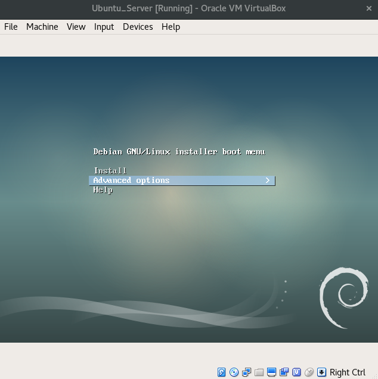

# :books: Lab Session 1: Virtual Machines
LINGI2145 Autumn, 2018 -- Etienne Rivière and Raziel Carvajal-Gómez

# Objectives
In this tutorial, you learn how to deploy a virtual infrastructure with several virtual machines linked by a virtual network, on your own laptop. You then deploy a representative application (web hosting service) on this virtual infrastructure. At the end of this tutorial you will learn how to:

- deploy Virtual Machines (VMs);
- create a network to let VMs communicate with each other;
- let your own laptop be part of a virtual network;
- install and deploy a web hosting service.

:warning: We do encourage you to follow the tutorial solo.

:warning: As for all other tutorials and for the project in LINGI2145, this tutorial assumes you are using an operating system with a UNIX-like command line built-in, such as MacOS X or any flavor of GNU/Linux.

:warning: This tutorial demands you to complete some exercises that are tagged with the symbol: :pencil2:

# Prerequisites
We will use [VirtualBox](https://www.virtualbox.org/) to deploy the infrastructure. The installation files are available at:

- [GNU/Linux based host](https://www.virtualbox.org/wiki/Linux_Downloads) such as: Debian, Ubuntu, Fedora, others
- [OS X](https://download.virtualbox.org/virtualbox/5.2.18/VirtualBox-5.2.18-124319-OSX.dmg)

Install VirtualBox by following those instructions. Consult the [official documentation](https://www.virtualbox.org/manual/ch02.html) for more details or troubleshooting.

# Create your first VM
Our goal is to deploy multiple VMs on the same host (your laptop). We will only access these VMs through the network. There is no need for a full desktop operating system with a GUI and many pre-installed software packages. We also want to limit the amount of resources (hard drive space, CPU, memory). VMs will host a minimalistic GNU/Linux Operating System (OS) with only the necessary software packages.

:bulb: Considering that your local machine will host every VM we create in this tutorial, the creation of minimal VMs avoids decreasing the performance of your system.

#### Setting up hard drive, CPU and memory
VBoxManage is the command line interface of VirtualBox. While using the GUI might seem simpler at first, it is not possible to do so in scripts. Learning the CLI right from the start is therefore better. The CLI allows controlling all features of the virtualization engine. We will use some useful commands of this interface, find further details on [this link](https://www.virtualbox.org/manual/ch08.html).

Open a console and set the variable `vm` to the name of our virtual machine.

`vm='Debian-based_VM'`

We now need a virtual hard drive to install the GNU/Linux OS and its system libraries. Create a dynamic hard drive with a maximum capacity of ~3GB.

`VBoxManage createhd --filename ${vm}.vdi --size 3072`

Then we register our VM and specify the type of OS.

`VBoxManage createvm --name ${vm} --ostype "Debian" --register`

Add hard drive controllers.

1. `VBoxManage storagectl ${vm} --name "SATA Controller" --add sata --controller IntelAHCI`
1. `VBoxManage storageattach ${vm} --storagectl "SATA Controller" --port 0 --device 0 --type hdd --medium ${vm}.vdi`

Additionally, we do require controllers of a DVD drive to boot our system from an ISO image.

`VBoxManage storagectl ${vm} --name "IDE Controller" --add ide`

Our VM will boot from a minimal ISO image of ~36MB that you can download clicking on [this link](http://ftp.nl.debian.org/debian/dists/stretch/main/installer-i386/current/images/netboot/mini.iso). We now attach the previously downloaded ISO image.

`VBoxManage storageattach ${vm} --storagectl "IDE Controller" --port 0 --device 0 --type dvddrive --medium /REPLACE/WITH/PATH/TO/mini.iso`

The following command specifies the boot order for the VM. First, the virtual machine manager will use the DVD virtual device (if attached), and then the hard drive if no DVD is present, as we would do for installing GNU/Linux on a physical PC.

`VBoxManage modifyvm ${vm} --boot1 dvd --boot2 disk`

Finally, we will set to 512~MB the amount of memory that our VM requires with:

`VBoxManage modifyvm ${vm} --memory 512 --vram 128`

#### Starting a VM
You are now ready to launch a VM with: `VBoxManage startvm ${vm}`.

**Automating the installation of your new OS.** VirtualBox pops up a new console as it is shown in the picture below.



The VM boots from the DVD device as we indicate before. To automate the installation procedure, we make use of a feature that sets each step of the installation with a list of predefined values; this automatic procedure is called [preseeding](https://www.debian.org/releases/stable/i386/apb.html.en). Chose the option *Advanced options -> Automated install*, you will see the next screen.


You are provided with the configuration file, simply, fill the text box with this URL `https://tinyurl.com/ybv4r2fh` and press `Continue`. This configuration file contains, for instance, the credentials of users. The administrator's authentication information is as follows: `user/password = root/root`.

**Booting from virtual disk.** Once the installation is complete, you will go back to the first step of the installation. **This is normal** because VirtualBox still considers the DVD as the primary boot device, and reboots from it, relaunching the installation procedure. We need to detach the DVD device to boot using the virtual disk. To do so, stop the VM with `VBoxManage controlvm ${vm} poweroff` and then select the virtual disk as primary device to boot with  `VBoxManage modifyvm ${vm} --boot1 disk`.

Start the VM again and log in using the **administrator's credentials**.

:pencil2: Change the appearance of your new terminal with `wget -O .bashrc https://tinyurl.com/ycv7e9ek && source .bashrc`

Power-off the VM via the command `shutdown -h now`; alternatively, you may also turn-off a virtual machine from a terminal of your laptop with `VBoxManage controlvm <name-of-your-vm> poweroff`

#### Setting up a virtual network
Eventually, we will deal with an infrastructure where more than one VM is running and where services are deployed on several virtual hosts. We need a network to let VMs communicate between them and with other services hosted elsewhere (for instance, an authentication service in the Cloud).

VirtualBox contains ready-made network interfaces, for instance, you can list the details of a pre-configured interface named **vboxnet0** with `VBoxManage list hostonlyifs`; you get an output as follows.

```
Name:            vboxnet0
GUID:            786f6276-656e-4074-8000-0a0027000000
DHCP:            Disabled
IPAddress:       192.168.33.1
NetworkMask:     255.255.255.0
IPV6Address:     
IPV6NetworkMaskPrefixLength: 0
HardwareAddress: 0a:00:27:00:00:00
MediumType:      Ethernet
Status:          Down
VBoxNetworkName: HostInterfaceNetworking-vboxnet0
```
:warning: In case the list of interfaces is empty, create one with the command `VBoxManage hostonlyif create`

The network interface `vboxnet0` already provides connectivity among virtual machines and your laptop (host system). Open a terminal and change the configuration of our VM to make use of this interface.

`VBoxManage modifyvm ${vm} --nic1 hostonly --hostonlyadapter1 vboxnet0`

:warning: Be sure that the value `${vm}` is **not empty** with `echo ${vm}`; otherwise, set it again with vm='Debian-based_VM'`.

**IP address resolution.** To assign a unique IP address for each VM within our virtual network, we create a [DHCP](https://en.wikipedia.org/wiki/Dynamic_Host_Configuration_Protocol) server.

`VBoxManage dhcpserver add --ifname vboxnet0 --ip <ip-prefix-for-vboxnet0>.2 --netmask 255.255.255.0 --lowerip <ip-prefix-for-vboxnet0>.11  --upperip <ip-prefix-for-vboxnet0>.12 --enable`

:warning: Replace `<ip-prefix-for-vboxnet0>` with the appropriate subnet. In this example, the value of `<ip-prefix-for-vboxnet0>` is the subnet `192.168.33` of the network `vboxnet0` (listed with `VBoxManage list hostonlyifs`).

:warning: In case the DHCP server already exists, replace `add` for `modify` in the previous command.

The previous command links a DHCP server with our virtual interface, assign the IP address `192.168.33.2` to it and create a pull of 2 IP address within the range `192.168.33.[11-12]`.

Start your VM again, log in using the administrator's credentials and verify that an IP address within the subnet `192.168.33` was assigned to your VM with the command `ip address`.

# Setting up a secure connection
As you notice, the console that VirtualBox pop-ups when you start a new VM is very useful when the host system have a desktop environment, however, on a regular basis we want remote and secure access to our VMs just like in a public IaaS Cloud.

At this point, you know the IP address of your VM and given that the network interface (`vboxnet0`) allows connectivity between your laptop (host system) and VMs running on it, you may use a terminal within your laptop.

Start your VM again, **but now**, running in the background with `VBoxManage startvm ${vm} --type headless`. This command tells VirtualBox to avoid displaying its built-in console. Now, start a remote connection to your VM via `ssh user@192.168.33.11` with the following credentials: `username=user` and `password=user`. You got an output as follows.

```
$ ssh user@192.168.33.11
user@192.168.56.11's password:
Linux debian 4.9.0-7-686 #1 SMP Debian 4.9.110-3+deb9u2 (2018-08-13) i686

The programs included with the Debian GNU/Linux system are free software;
the exact distribution terms for each program are described in the
individual files in /usr/share/doc/*/copyright.

Debian GNU/Linux comes with ABSOLUTELY NO WARRANTY, to the extent
permitted by applicable law.
Last login: Fri Sep 21 13:36:18 2018 from 192.168.56.1
user@debian:~$
```

You just log in within your VM via a terminal in your laptop.

#### Allowing automatic log in
A [RSA key pair](https://en.wikipedia.org/wiki/Public-key_cryptography) allow you to to open a secure connection between hosts. To do so, we first need to create a key pair as follows.

1. Open a new terminal within your laptop
1. Type down the command `ssh-keygen -t rsa -C ""`
1. When you are asked to provide a file name, type down `./rsa_key`
1. When you are asked to provide a passphrase, ***leave this option empty***

Keep the private key file `rsa_key` in a safe location for future use. The content of a public key (file `rsa_key.pub`) will remain within hosts you may access to.

:pencil: **Note:** If you already have your own SSH key, feel free to use it in the following.

Share the RSA public key with the VM as follows:

1. Go back to the terminal you use to log in the VM
1. Type down the command `su` and write `root` as password
1. Change of directory and create the folder `.ssh` with `cd ~/; mkdir .ssh`
1. Create a file to store authorized keys with `editor .ssh/authorized_keys`
1. Copy/paste the content of the public RSA key
1. Press they keys *Ctrl+O*, confirm the changes and leave the editor with *Ctrl+X*

Now, you can create another session into the VM with `ssh -o IdentityFile=/PATH/TO/PRIVATE/RSA/KEY/rsa_key root@192.168.33.11`.

:pencil: **Note:** This time you weren't asked to write authentication information.

In another terminal, turn off the VM with `vm='Debian-based_VM'; VBoxManage controlvm ${vm} poweroff` and confirm that you were logged out from every session to the VM.

# Launching multiple VMs
To avoid the relatively long process of setting up a new VM, we will rather reuse an image from the existing one.
You can create a copy of the previous VM as shown below.

`VBoxManage clonevm ${vm} --name ${vm}-clone --register`

:warning: The execution of this command may take up to 5 min.

Now you are ready to start a new VM called `${vm}-clone`, log into it and consult the IP address that was assigned to this new host. Both VMs belong to the same network, therefore, they can communicate with each other.

:pencil2: **Exercise.** Check that you can use SSH with the new VM too.

# Deploy a Web application
Until now, we have a virtual infrastructure with 2 VMs linked by a network and we will make use of this infrastructure to deploy [Wordpress](https://wordpress.com/), a popular Web hosting service.

:bulb: The VM already contains every package we require for deploying Wordpress; these packages are: `wordpress`, `apache2`, `mariadb-server`, `mariadb-client` and `php-mysql`.

A typical deployment of WordPress uses separate machines for the web server, its static content and the database keeping the dynamic content. Our aim is then host:

- a database within a VM
- and a web server in a second VM

In separate terminals, power on both VMs and log into each one via SSH.

:warning: We will refer to `IP_ADDR_OF_DB_HOST` as the IP address of a first VM that contains the database and with `IP_ADDR_OF_WEB_SERVER` as the IP address of a second VM that contains the web server. For the rest of this tutorial, replace these aliases with the assigned IP address on each VM.   

#### Setting up the database host
First, allow other VMs refer to the database (DB) by the local host's IP address as follows:

1. Open the DB system's configuration file with: `editor /etc/mysql/mariadb.conf.d/50-server.cnf`
1. Scroll down and find the first line that contains this parameter `bind-address`
1. Replace the whole line with `bind-address = IP_ADDR_OF_DB_HOST`
1. Apply the new changes with `systemctl restart mysql`

Then, we need to create the DB that Wordpress requires. Create the file `wp.sql` and add the following content.

```sql
CREATE DATABASE wordpress;

GRANT SELECT, INSERT, UPDATE, DELETE, CREATE, DROP, ALTER
  ON wordpress.*
  TO wordpress@IP_ADDR_OF_WEB_SERVER
  IDENTIFIED BY 'wordpress';

FLUSH PRIVILEGES;
```

With the previous instructions, we indicate the DB system to create a new DB (called `wordpress`) and grant access to only one user that initiates a connection from the web sever. The authentication information of such a user is as follows: `username/password=wordpress/wordpress`.

Apply the previous configuration with `cat wp.sql | mysql --defaults-extra-file=/etc/mysql/debian.cnf` and list all available databases with `mysql -e "show databases"`.

#### Setting up the web server
We will now configure a web server in your second VM. In Wordpress, you can start creating a new site by adding the next content in the file
`/etc/apache2/sites-available/wp.conf`.

:warning: Be sure to replace `IP_ADDR_OF_WEB_SERVER` with the appropriate value.

```java
<VirtualHost *:80>

  ServerName IP_ADDR_OF_WEB_SERVER

  DocumentRoot /usr/share/wordpress
  Alias /wp-content /var/lib/wordpress/wp-content

  <Directory /usr/share/wordpress>
    Options FollowSymLinks
    AllowOverride Limit Options FileInfo
    DirectoryIndex index.php
    Require all granted
  </Directory>

	<Directory /var/lib/wordpress/wp-content>
		Options FollowSymLinks
    Require all granted
  </Directory>

  ErrorLog ${APACHE_LOG_DIR}/error.log
  CustomLog ${APACHE_LOG_DIR}/access.log combined

</VirtualHost>
```

Then, overwrite the default configuration with the previous one with these commands:

  - `a2dissite 000-default`
  - `a2ensite wp`
  - `systemctl reload apache2`

Finally, link the DB and the web server by creating a PHP file with the command `editor /etc/wordpress/config-IP_ADDR_OF_WEB_SERVER.php` and add this content:

```php
<?php
  define('DB_NAME',       'wordpress');
  define('DB_USER',       'wordpress');
  define('DB_PASSWORD',   'wordpress');
  define('DB_HOST',       'IP_ADDRESS_OF_DB_HOST');
  define('WP_CONTENT_DIR','/var/lib/wordpress/wp-content');
?>
```

That's it, you can now start using Wordpress to design your new web site :sunglasses:

#### Start using Wordpress
In your web browser just type down the IP address of the web server, you will see the Welcome page of Wordpress.

 

 Follow the instructions of the welcome page and once you authenticate, the Dashboard window of Wordpress pop ups.

 

Find more details about how to customize your web content in the [official site](https://www.wordpress.com).

:checkered_flag: **Congratulations, you made it !**. Do not forget to stop your VMs to avoid decreasing the performance of your system.
