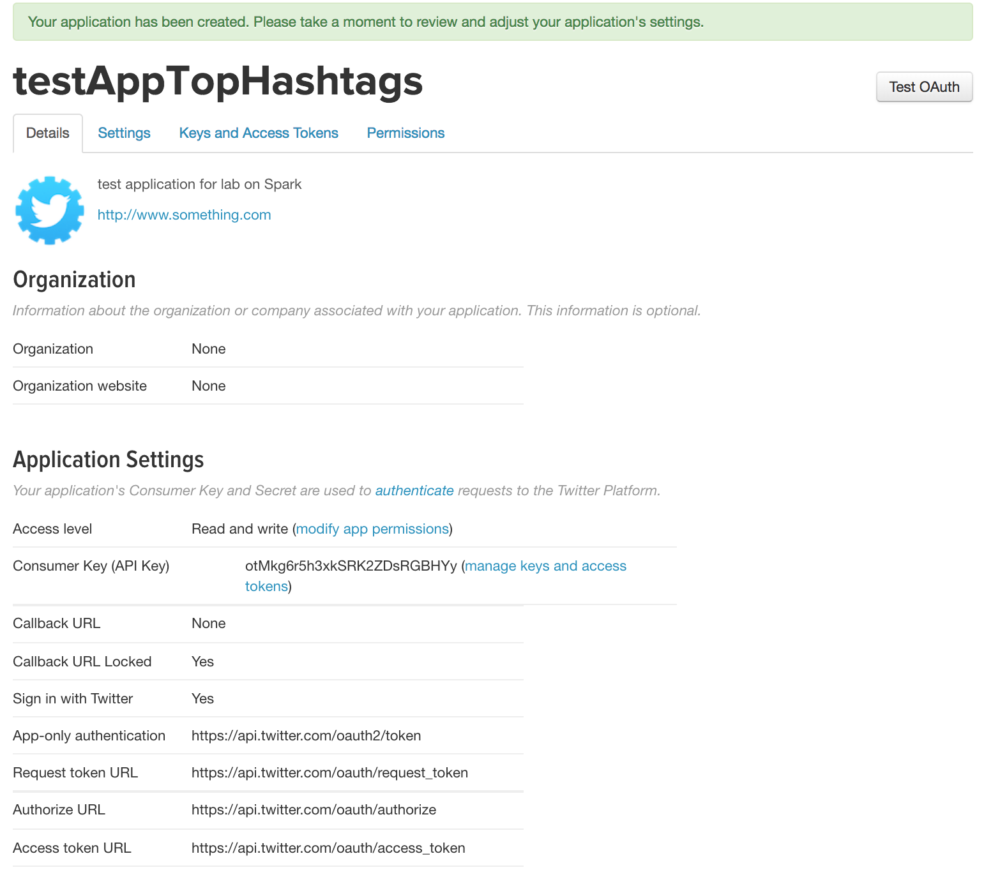

# :books: Apache Spark
LINGI2145 Spring 2018 -- Etienne Rivière and Raziel Carvajal-Gómez

# Objectives

In this tutorial, you'll be introduced to Apache Spark, an open-source data analytics cluster computing framework which builds on top of Hadoop Distributed File System (HDFS). From the lectures, you are familiar with advantages of using Spark and what it has to offer. Now, we are going to go through practical examples. We will start with running a Word Count example, followed by K-Means clustering algorithm and finally, a Stream Processing example.

<sup>Adapted from Apache Spark lab by M. Bilal and Prof. Marco Canini @ UCLouvain, Fall 2015 </sup>

# General instructions

1. Go to the directory `06_ApacheSpark/src` and start your VM using `vagrant up`.

2. (Optional) If you want to use Scala language, you can install Scala and SBT in the VM. We will use Java/Maven for the instructions.

3. To run Spark applications, you need to perform following steps:

- First, package the code into a .jar file using a tool called Maven. To do this, just browse to your project directory (e.g. KMeans) and type `mvn package` into your console.

If you are running `mvn` using the default configuration, the `<package>.jar` file will be located in the `target` directory.

- After bundling your application, you can launch it by running:

`/usr/local/spark/bin/spark-submit --class <classname> --master local[<number of worker threads>] target/<package>.jar`


# Quick start with WordCount

Let's first get acquainted with Spark. We will follow the Quick Start tutorial from the [official project documentation](http://spark.apache.org/docs/1.5.2/quick-start.html).

### Basics

Spark's shell provides a simple way to learn the API, as well as a powerful tool to analyze data interactively. It is available in either Scala (which runs on the Java VM and is thus a good way to use existing Java libraries) or Python. Start it by running:

`/usr/local/spark/bin/spark-shell`

Spark's primary abstraction is a distributed collection of items called a Resilient Distributed Dataset (RDD). RDDs can be created from Hadoop InputFormats (such as HDFS files) or by transforming other RDDs. Make a new RDD from the text of the `README` file in the Spark source directory:

```scala
scala> val textFile = sc.textFile("/labs/README.md")

textFile: org.apache.spark.rdd.RDD[String] = MapPartitionsRDD[1] at textFile at <console>:21
```

RDDs have actions, which return values, and transformations, which return pointers to new RDDs. Let's perform some actions:
```scala
scala> textFile.count() // Number of items in this RDD

res0: Long = 22

scala> textFile.first() // First item in this RDD

res1: String = "This project uses maven as the build system. "
```

Now we will use the filter transformation to return a new RDD with a subset of the items in the file:
```scala
scala> val linesWithJar = textFile.filter(line => line.contains("jar"))

linesWithJar: org.apache.spark.rdd.RDD[String] = MapPartitionsRDD[2] at filter at <console>:23
```

We can chain together transformations and actions:
```scala
scala> textFile.filter(line => line.contains("jar")).count() // How many lines contain "jar"?

res2: Long = 7
```

### More on RDD Operations

RDD actions and transformations can be used for more complex computations. Let's say we want to find the biggest number of words over all lines:
```scala
scala> textFile.map(line => line.split(" ").size).reduce((a, b) => if (a > b) a else b)

res3: Long = 22
```
This first maps a line to an integer value, creating a new RDD. `reduce` is called on that RDD to find the largest line count. The arguments to `map` and `reduce` are Scala function literals (closures), and can use any language feature or Scala/Java library.

For example, we can easily call functions declared elsewhere. We'll use `Math.max()` function to make this code easier to understand:
```scala
scala> import java.lang.Math

import java.lang.Math

scala> textFile.map(line => line.split(" ").size).reduce((a, b) =>

Math.max(a, b))

res4: Int = 22
```
One common data flow pattern is MapReduce, as popularised by Hadoop. Spark can implement MapReduce flows easily:
```scala
scala> val wordCounts = textFile.flatMap(line => line.split(" ")).map(word => (word, 1)).reduceByKey((a, b) => a + b)

wordCounts: org.apache.spark.rdd.RDD[(String, Int)] = ShuffledRDD[8] at reduceByKey at <console>:24
```
Here, we combined the `flatMap`, `map` and `reduceByKey` transformations to compute per-word counts in the file as an RDD of `(String, Int)` pairs. To collect the word counts in our shell, we can use the `collect` action:
```scala
scala> wordCounts.collect()

res5: Array[(String, Int)] = Array((package,1), (For,2), (this,2), (Jar,2),(it,1), (is,4), (The,3), (VM,1), (run,2), ...)
```

You can experiment for a few minutes on your own with the transformations and actions documented at [the official programming guide](http://spark.apache.org/docs/1.5.2/programming-guide.html) and you may refer to the Java documentation of the  [RDD class](https://spark.apache.org/docs/latest/api/java/org/apache/spark/rdd/RDD.html).

# K-Means Clustering

In this exercise, we will learn how to apply a machine-learning algorithm, K-means clustering, on data using the Spark framework. To apply most machine learning algorithms, we must first preprocess and featurise the data. That is, for each data point, we must generate a vector of numbers describing the salient properties of that data point.

We have already done this step for you. In our case, each data point will consist of a unique Wikipedia article identifier (i.e., a unique combination of Wikipedia project code and page title) and associated traffic statistics. We generated 24-dimensional feature vectors; with each feature vector entry summarising the page view counts for the corresponding hour of the day.

The K-Means clustering algorithm objective is to partition your data into `K` clusters. In a nutshell, the algorithm is as follows:

- Initialise centroids (central points for each cluster) by randomly picking `K` points from the input dataset

- Discern the closest point to each centroid by computing the squared distance between each point and centroid

- Assign points sharing the same centroid to a cluster

- Re-calculate the centroids by averaging the values of points for every cluster

- Repeat the process until the margin of error between centroids is less than a predefined threshold

In this exercise, we've created a standalone Spark application that takes in the aforementioned featurised file as an input and returns a sample of the resulting clusters.

### Tasks
Before starting, first familiarise yourself with the code, and how the function operates. This shouldn't require any prior machine-learning background. Your task is to implement the `ClosestPoint` function in order to calculate the closest points to a centroid.

You'll also need to calculate the error between the older and newer centroids (this is the aggregated squared distances between the centroid vectors).

Before starting to work on these tasks, please refer to the following files:

- `KMeans/src/main/java/WikipediaKMeans.java`: This is your main class, which should comprise all the clustering functionality

- `KMeans/src/main/resources/wiki-stats`: This is the featurised input file that you'll be using as an input to your K-Means clustering algorithm.


# Stream Processing with Twitter

In this exercise, we will walk you through using Spark Streaming to process live data streams. This exercise is designed as a standalone Java program that will receive and process Twitter's real sample tweet streams.

### Setup

Before starting, you need to setup your twitter tokens. First, open [this link](https://apps.twitter.com/). This page lists the set of Twitter-based applications that you own (of course, this list will be empty if you have never created any applications). For this tutorial, create a new temporary application. To do this, click on "Create new App" button. You should see a page similar to the one below:


1. Provide the required fields. The Name of the application must be globally unique, so using your Twitter username as a prefix to the name should ensure that. For example, set it as `[your-twitter-handle]-test`. For the Description, anything is fine. For the Website, similarly, any website is fine, but ensure that it is a fully-formed URL with the prefix `http://`. Leave the Callback URLs field empty. Then, click on the checkbox below the Developer Agreement and then `Create your Twitter application` button.

2. Once you have created the application, you will be presented with a confirmation page (as shown below). You should be able to see the consumer key and the consumer secret. To generate access token its secret, click on the `Keys and Access Tokens` tab. Then click on `Create my access token` on the bottom of the page.



3. Finalize the keys and secrets required for authentication by clicking `Test OAuth` button on top right of the page.

4. Finally, update your twitter configuration file (located at `src/main/resources/twitter.txt`) using your favourite text editor. You should see a template of separated key-value pairs already setup (like the one shown below)

```text
consumerKey =
consumerSecret =
accessToken =
accessTokenSecret =
```
Copy the values of your keys into this file and save it.

### Exercise

In this exercise, we will work on processing a stream of tweets and then output the top 10 most frequently found hashtags in a 5-minute window that shifts in 1-second increments.

Before starting to work on the tasks, please refer to the following files:
- `Twitter/src/main/java/TwitterStreaming.java`: This is your main class, which should comprise the entire stream processing functionality.

- `Twitter/src/main/resources/twitter.txt`: This is the Twitter OAuth configuration file which should have your access keys

After setting up your keys, refer to the `TwitterStreaming.java` file in your directory. Walkthrough the code, and make sure you read the comments and can understand the general structure of the application. You need to implement the following tasks to make the application work:

1. Split the retrieved tweets into words

2. Fetch the hashtags from these words

3. Map hashtags to integer values of 1

## :warning: Useful notes

You'll find the following functions useful for running transform operations on the `JavaPairDStream` object:

- `map(func)`: Returns a new `DStream` by passing each element of the source `DStream` through a function `func`.

- `flatMap(func)`: Similar to `map`, but each input item can be mapped to 0 or more output items.

- `mapToPair(func)`: Returns a new `JavaPairDStream` by passing each element of the source `JavaPairDStream` through a function `func`.

- `filter(func)`: Returns a new `DStream` by selecting only the records of the source `DStream` on which `func` returns true


You can consult Apache Spark's [programming guides]( https://spark.apache.org/docs/1.5.2/programming-guide.html) and/or [API](https://spark.apache.org/docs/1.5.2/api/java/index.html) for more details.


If twitter refuses to authenticate and returns a `401` error, this could possibly mean:
- Your keys are incorrect. In which case, you need to verify the correctness of the keys entered in your `twitter.txt` configuration file
- The timestamps for your requests are behind. Verify that your VM's clock isn't lagging behind (use the command `date` to check time and date).
- For more information on what the different response codes entail, visit: [https://developer.twitter.com/en/docs/basics/response-codes](https://developer.twitter.com/en/docs/basics/response-codes)

- You might receive a warning similar to: `Block input-x-xxxx already exists on this machine; not re-adding it` while running the streaming application. This is quite normal; it occurs because Spark attempts to replicate streaming data without having any actual nodes (because we are running everything locally).
